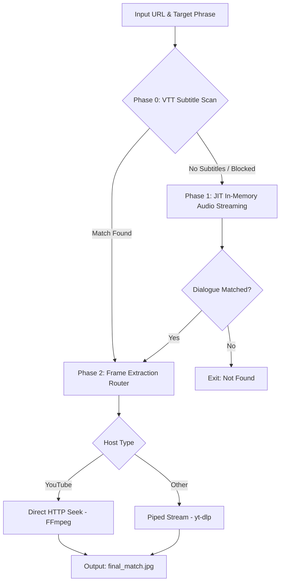

# Technical Approach: Dialogue Frame Detector v2

## 1. Core Philosophy
**"Zero-Bandwidth First, JIT-Memory Second."**
Instead of downloading full videos and processing them on disk, the system extracts exact frames from remote streams (YouTube, OK.ru) using a phased fallback pipeline — minimizing bandwidth, disk I/O, and latency.

## 2. Three-Phase Pipeline

**Phase 0 — Subtitle Scan (Zero-Bandwidth)**
- Checks for native VTT transcripts via `yt-dlp` (`skip_download=True`) before touching media.
- Uses a **sliding text window** (combines 3 adjacent subtitle lines) to catch phrases split across blocks, then applies fuzzy matching (`is_candidate`).
- Result: instant timestamp resolution, no download.

**Phase 1 — JIT In-Memory Audio Streaming (Diskless)**
- Runs only if no usable transcript exists.
- `yt-dlp` pipes raw audio bytes directly into `ffmpeg` → decoded live to 16kHz float32 PCM. No temp files.
- Python reads `stdout` in 3-minute chunks, converts via `np.frombuffer`, feeds to local `faster-whisper` (`tiny.en`).
- **Deadlock fix:** on early match, background subprocesses are killed via `stdout.close()` + `.kill()` (SIGKILL) to avoid hangs.

**Phase 2 — Frame Extraction Router (CDN Bypass)**
- Dual strategy based on host, since aggressive CDNs block naive requests:
  - **YouTube/standard:** direct HTTP seek — resolve stream URL, pass timestamp via `-ss` to `ffmpeg`.
  - **OK.ru/aggressive CDNs:** `yt-dlp` handles the handshake (browser-header mimicry, SSL bypass), pipes bytes to `ffmpeg` with post-input seek (`-i pipe:0 -ss [time]`) to avoid black frames.

## 3. Key Decisions & Trade-offs
| Decision | Reason |
|---|---|
| RAM-bound over disk-based | No disk wear, lower latency, clean workspace |
| Hard `.kill()` over graceful shutdown | Live pipes hang on graceful exit; hard kill guarantees deterministic termination |
| Platform-aware routing | YouTube and OK.ru have very different anti-bot/CDN behavior — one strategy doesn't fit both |

## 4. Tech Stack
- **yt-dlp** — metadata, VTT subtitles, stream URL resolution
- **faster-whisper** — CPU-efficient local transcription on memory buffers
- **ffmpeg/ffprobe** — PCM decoding, stream piping, frame extraction
- **numpy** — `np.frombuffer` bridge from raw PCM to Whisper-ready arrays
- **rapidfuzz** — fuzzy matching to tolerate transcription noise
