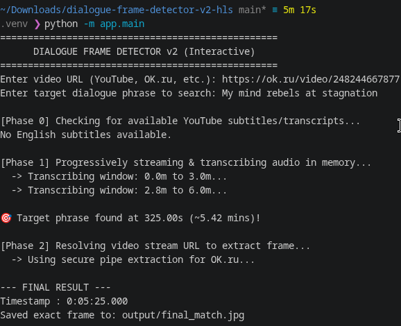
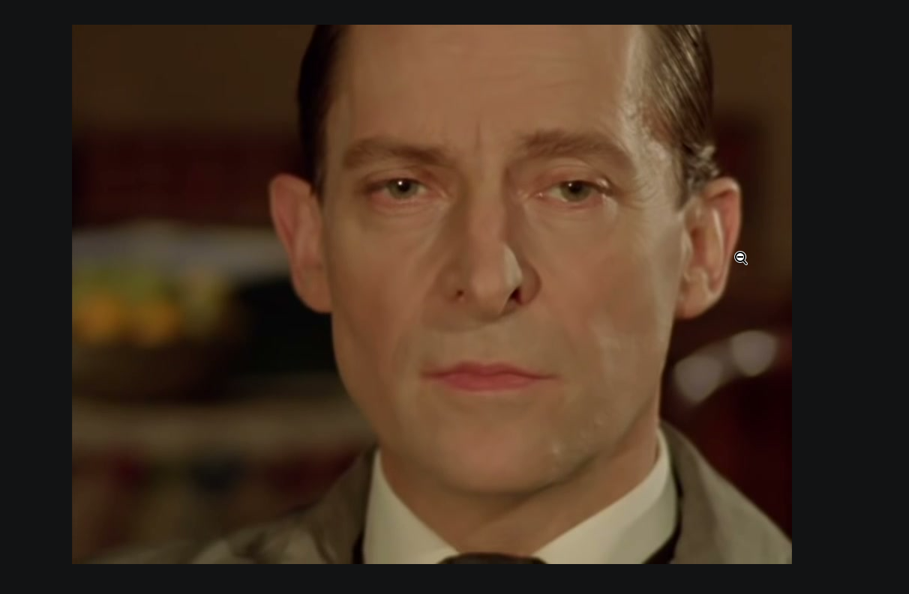
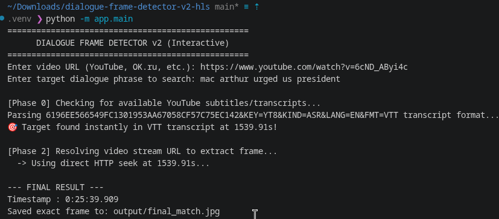
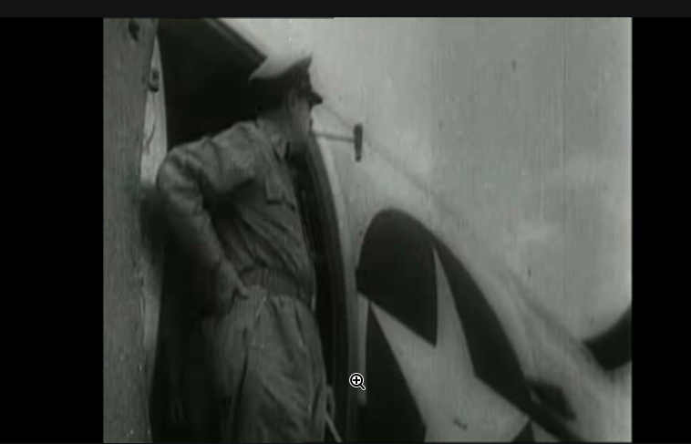

# Dialogue Frame Detector v2

Find the exact video frame where a spoken line of dialogue occurs — without downloading the video. Give it a URL (YouTube, OK.ru, etc.) and a target phrase, and it returns the timestamp plus a saved frame.

## How It Works

A three-phase, diskless pipeline that only escalates when it has to:

1. **Subtitle Scan** — checks for native VTT/JSON3 transcripts via `yt-dlp` first. If the phrase is there, resolves instantly with zero media download.
2. **In-Memory Audio Streaming** — if no transcript exists, streams audio straight from `yt-dlp` into `ffmpeg` into RAM (no temp files), transcribing 3-minute rolling windows with `faster-whisper` until a fuzzy match is found.
3. **Frame Extraction** — routes by host: direct HTTP seek (`ffmpeg -ss`) for YouTube/standard CDNs, and a secure piped stream for OK.ru and other CDNs that block naive requests.

Full design rationale in [`DESIGN.md`](./DESIGN.md).

## Project Structure

```
app/
├── main.py               # CLI entry point + Phase 1 (streaming) & Phase 2 (extraction)
├── subtitle_scanner.py   # Phase 0 — VTT/JSON3 transcript scan
└── matcher.py            # Fuzzy phrase matching (substring + sliding window)
images/
requirements.txt
DESIGN.md
```

## Setup

Requires **Python 3.11+** and system installs of **`ffmpeg`** / **`ffprobe`**.

```bash
pip install -r requirements.txt
```

## Usage

```bash
python -m app.main
```

You'll be prompted for a video URL and the target dialogue phrase. The matched frame is saved to `output/final_match.jpg`.

### Example — OK.ru (falls back to audio transcription)

```
Enter video URL (YouTube, OK.ru, etc.): https://ok.ru/video/2482446678...
Enter target dialogue phrase to search: My mind rebels at stagnation

[Phase 0] Checking for available YouTube subtitles/transcripts...
No English subtitles available.

[Phase 1] Progressively streaming & transcribing audio in memory...
  -> Transcribing window: 0.0m to 3.0m...
  -> Transcribing window: 2.8m to 6.0m...
🎯 Target phrase found at 325.00s (~5.42 mins)!

[Phase 2] Resolving video stream URL to extract frame...
  -> Using secure pipe extraction for OK.ru...

--- FINAL RESULT ---
Timestamp : 0:05:25.000
Saved exact frame to: output/final_match.jpg
```




### Example — YouTube (instant subtitle match)

```
Enter video URL (YouTube, OK.ru, etc.): https://www.youtube.com/watch?v=6cND_ABYi4c
Enter target dialogue phrase to search: mac arthur urged us president

[Phase 0] Checking for available YouTube subtitles/transcripts...
Parsing ... transcript format...
🎯 Target found instantly in VTT transcript at 1539.91s!

[Phase 2] Resolving video stream URL to extract frame...
  -> Using direct HTTP seek at 1539.91s...

--- FINAL RESULT ---
Timestamp : 0:25:39.909
Saved exact frame to: output/final_match.jpg
```




## Tech Stack

- **yt-dlp** — metadata, subtitles, stream URL resolution
- **faster-whisper** (`tiny.en`) — local CPU transcription
- **ffmpeg / ffprobe** — audio decoding, frame extraction
- **numpy** — raw PCM → Whisper-compatible arrays
- **difflib (SequenceMatcher)** — fuzzy phrase matching in `matcher.py`


## Future Work

- **OCR on Extracted Frames** — run Tesseract/EasyOCR on `final_match.jpg` to auto-verify the match by checking for on-screen captions, subtitles burned into the frame, or overlay text, and flag false positives when no supporting text is found.
- **Confidence Scoring** — surface the fuzzy-match score (from `matcher.py`) alongside the timestamp so users can gauge match reliability instead of a binary found/not-found result.
- **Batch Mode** — accept a list of (URL, phrase) pairs from a CSV/JSON file and process them sequentially, useful for building frame datasets across multiple videos.
- **Scene-Boundary Snapping** — detect nearby scene cuts (via `ffmpeg`'s scene-detection filter) so the extracted frame lands on a clean shot rather than mid-transition.
- **Web/API Interface** — wrap the CLI in a lightweight FastAPI endpoint so the detector can be triggered remotely instead of only via the interactive terminal prompt.
- **Caching Layer** — cache resolved stream URLs and transcripts per video ID to avoid re-resolving on repeated queries against the same video.
- **Additional Host Support** — extend the Phase 2 router beyond YouTube/OK.ru to other `yt-dlp`-supported platforms (Vimeo, Dailymotion, etc.), each with their own CDN-bypass strategy as needed.